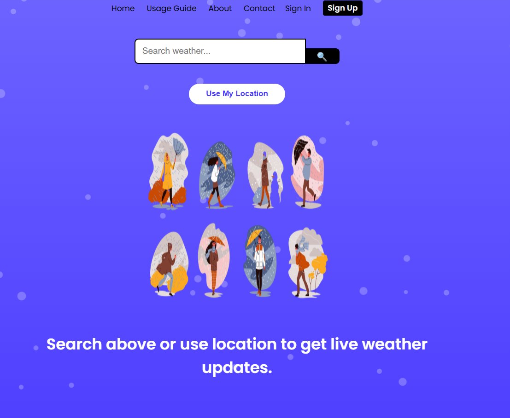
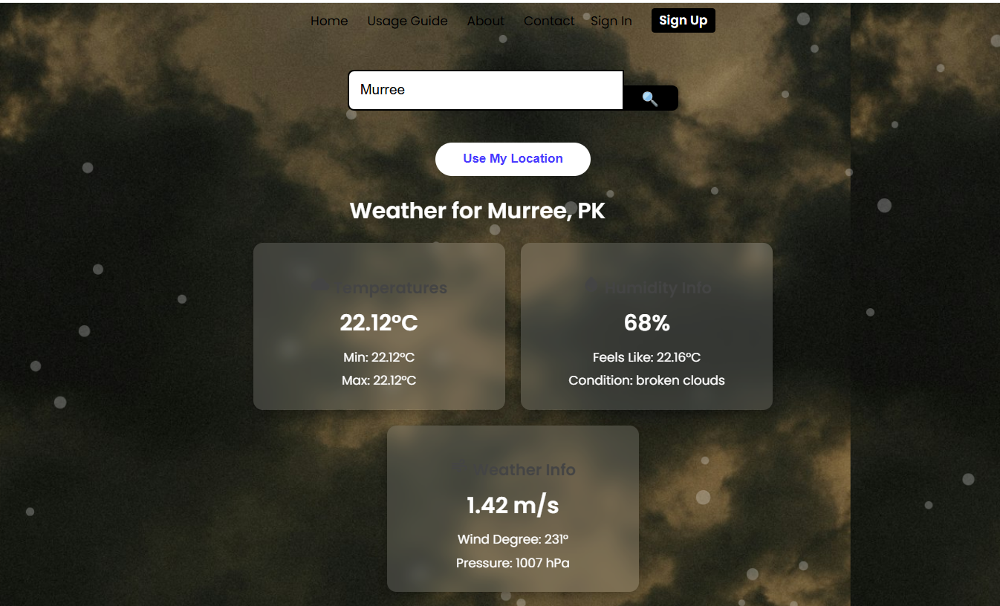
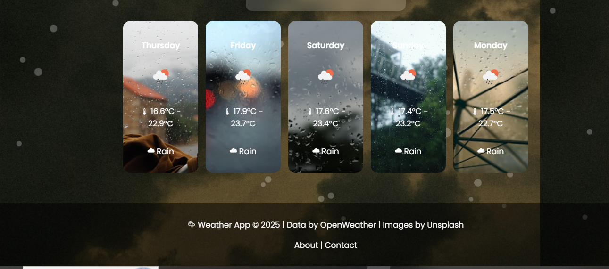
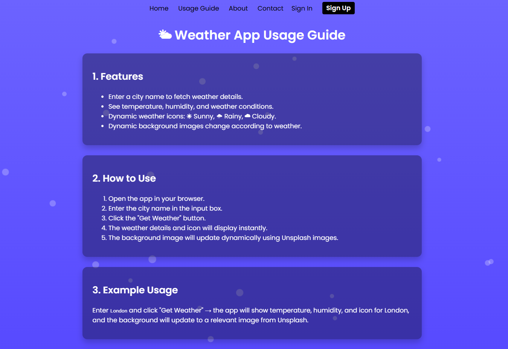
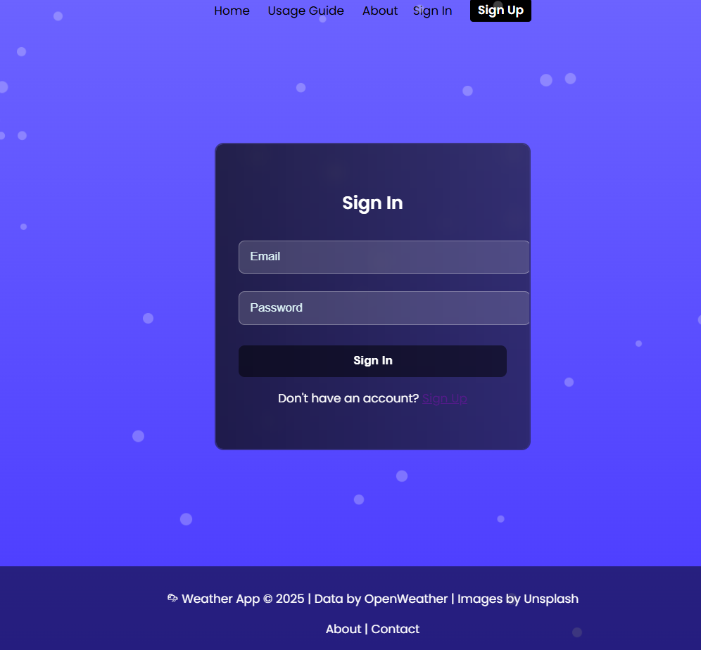

# Weather App

A clean and responsive weather web application built as a **frontend assignment for Internee.pk**. The app allows users to search for any city and get real-time weather information, including temperature, humidity, and forecast details.

---

## Features

- Search weather by **city name**.
- Display **current temperature**, **humidity**, **wind speed**, and **weather condition**.
- Show **weather icons** (☀, 🌧, ☁) for easy visualization.
- Display a **5-day forecast** with temperature ranges and weather conditions.
- **Responsive design** for desktop and mobile devices.
- Dynamic **background images** based on current weather.

---

## 🛠 Technologies Used

- **HTML5** – Semantic and structured markup.
- **CSS3** – Styling, animations, responsive layout.
- **JavaScript (ES6+)** – Fetching data from APIs, DOM manipulation.
- **OpenWeather API** – Provides live weather data.
- **Unsplash API** – Fetches dynamic background images based on weather conditions.

---

## Screenshot

---
